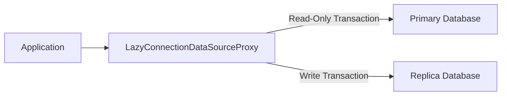

# Spring Boot Primary-Replica Routing Data Source Example

This project demonstrates a Spring Boot implementation for dynamic routing between primary and replica databases. It includes features such as connection pooling and transaction-based routing.

## Technologies

- **Spring Boot 3**
- **HikariCP** (Connection Pooling)
- **PostgreSQL**

## Architecture

Below is the architecture of the system:



## Configuration

Add the following configuration to your `application.yml`:

```yaml
spring:
  datasource:
    primary:
      url: jdbc:postgresql://localhost:5432/primary
      username: primary_user
      password: primary_pass
      maximum-pool-size: 20
    replica:
      url: jdbc:postgresql://localhost:5433/replica
      username: replica_user
      password: replica_pass
      maximum-pool-size: 10
```

### Steps to Run the Project

1. **Clone the Repository**:

    ```bash
    git clone https://github.com/LuizGC/dbreplication.git
    cd dbreplication
    ```

2. **Set Up PostgreSQL Using Docker Compose**:

   Make sure you have Docker running, then use Docker Compose to start the PostgreSQL containers:

    ```bash
    docker-compose up -d
    ```

3. **Build the Spring Boot Application**:

   Run the following command to build the project with Gradle:

    ```bash
    ./gradlew build
    ```

4. **Run the Spring Boot Application**:

   Once the build is successful, run the application:

    ```bash
    ./gradlew bootRun
    ```

   The application will start up, and the dynamic routing will be applied based on the `@Transactional` annotations in your code.

5. **Access PgAdmin**:

   If you want to monitor your databases, you can access PgAdmin via the Docker container. The connection details are provided in the `docker-compose.yml` file.

   Default credentials:
    - Username: `admin`
    - Password: `admin`
